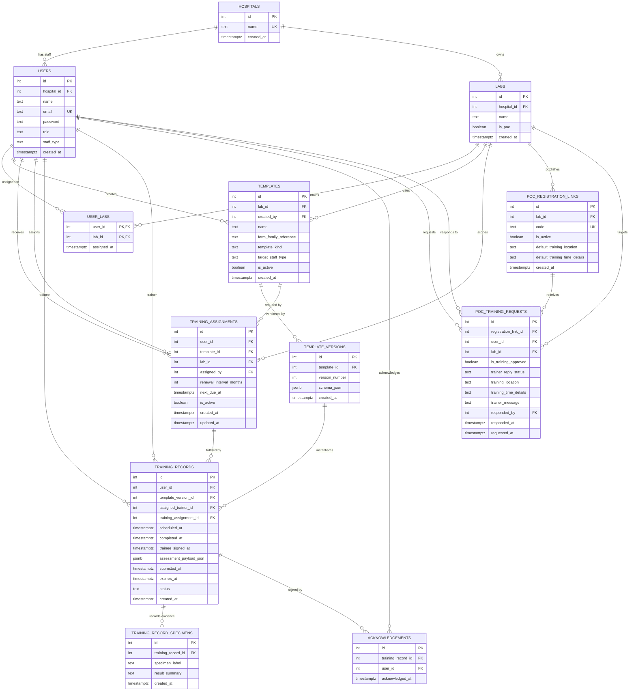

# Lab Competence Portal

# Project Proposal

## 1. Executive Summary

The Lab Competence Portal is a proposed digital platform for managing laboratory training, competency assessment, due-date tracking, and staff training records across one hospital or multiple hospitals.

The project is intended to replace paper-based competency forms and manual spreadsheet tracking with a modern web application that allows:

- laboratory staff to view training assignments and record evidence of competence
- section trainers to review records and manage training activity
- training co-ordinators/admins to maintain users, lab sections, templates, assignments, and renewal schedules
- Point of Care (POC) medical and nursing staff to request training by scanning a QR code
- future extension toward reminder emails, digital signoff workflows, and structured competency testing

This proposal uses Biochemistry and Point of Care training as the main examples, but the system is designed to support other laboratory sections and other hospitals over time.

## 2. Project Objectives

## 2.1 Primary Objective

To build a secure, scalable, and user-friendly digital training and competency management system for medical laboratory services that improves training traceability, reduces paper handling, and supports accreditation readiness.

## 2.2 Operational Objectives

- Replace paper training forms and manually maintained training spreadsheets with a centralised digital platform
- Maintain clear staff training records by section, analyser, and template version
- Allow training co-ordinators to assign staff to section-specific training and set renewal schedules
- Allow trainers to review records, enter competency outcomes, and manage section training workflows
- Allow ordinary staff to see their own training assignments and evidence records
- Allow POC users to self-register training requests through QR links instead of requiring manual account setup for every new trainee
- Provide a foundation for automated reminder emails before training expires
- Support future enhancement of POC renewal assessments using fixed MCQs and later AI-generated question banks

## 2.3 Governance and Accreditation Objective

Training and competency records are important evidence for laboratory quality systems and accreditation. The app is intended to support better traceability of:

- who was trained
- what section/template was used
- which template version was active at the time
- which trainer or co-ordinator managed the workflow
- when training was scheduled, completed, signed, and due for renewal
- what specimen evidence or assessment data was captured

The system does not intentionally store patient clinical data, but staff training records remain sensitive governance records and should be protected and backed up appropriately before production rollout.

## 3. Proposed Application Design

## 3.1 Product Concept

The application is a role-based dashboard for staff, trainers, and training co-ordinators/admins.

The current UI is designed as a modular React frontend with Bulma styling, backed by a Fastify/PostgreSQL API.

The dashboard is organised around six main functional areas:

- **Overview**
  Summary of training activity, due records, and available templates

- **Users**
  Creation and review of staff, trainers, training co-ordinators, and POC users

- **Due Training**
  Assignment of staff to recurring section templates and tracking of renewal dates

- **Templates**
  Creation and maintenance of reusable form definitions by lab section and staff type

- **Records**
  Creation and review of trainee-specific training/competency records, including specimen evidence and structured assessment notes

- **Sections**
  Lab/department navigation and filtering

## 3.2 Ordinary Laboratory Training Workflow

For Biochemistry or other ordinary non-POC sections, the proposed workflow is:

1. Admin/training co-ordinator creates hospital users, trainers, and section templates
2. Admin/co-ordinator assigns staff to section templates with renewal intervals and next due dates
3. Trainer and trainee carry out the section training and competency assessment process
4. Evidence such as specimen numbers, dates, and assessment outcomes are recorded digitally
5. The trainee record is stored against the relevant template version
6. Future due dates support dashboard monitoring and reminder emails

## 3.3 POC Training Workflow

POC has a different workflow because the number of medical/nursing users can be large and users may come from more than one hospital.

The proposed POC workflow is:

1. Admin/training co-ordinator creates a QR registration link tied to a POC lab/device
2. A POC user scans the code and submits name, email, home hospital, and password
3. The backend creates a POC training request and marks the training request as approved for scheduling
4. The trainer replies with a training location, time details, and a message
5. When scheduled, the trainee is linked to the POC lab training pathway
6. After face-to-face training, a digital record can be completed and retained for audit and renewal tracking

This workflow reduces trainer/co-ordinator workload by avoiding manual creation of very large numbers of POC accounts one by one.

## 3.4 Template Design Principle

The paper forms currently share a common document family, for example `FOR-CUH-PAT-2`, but differ by section/instrument and staff category.

Instead of creating one SQL table per paper form, the system uses:

- one `templates` table for reusable template metadata
- one `template_versions` table for versioned form structures
- JSON schema content in `template_versions.schema_json` to represent variable sections, objectives, references, checklist rows, signature blocks, or POC checklist structures
- one `training_records` table for trainee-specific instances derived from a template version

This allows IDS-i10, AU5800, DXA 5000, Senior Medical Scientist, Training Co-ordinator, and POCT forms to belong to the same form family while still supporting different content and structure.

## 3.5 Example Template JSON Concept

```json
{
  "formTitle": "Training Event and Competency Assessment Form",
  "formFamilyReference": "FOR-CUH-PAT-2",
  "sections": [
    {
      "type": "training_event",
      "code": "TE / Clinical Chemistry AU5800",
      "description": "Review of SOPs and task-based training for tests run on the AU5800 analyser series.",
      "objectives": [
        "Work in Clinical Chemistry area on the AU5800 analyser",
        "Perform maintenance, calibration, QC, and sample processing under supervision"
      ]
    },
    {
      "type": "competency_assessment",
      "code": "CA / Clinical Chemistry AU5800",
      "tasks": [
        {
          "taskLabel": "Maintenance and load reagents",
          "assessmentMethod": "DOWP"
        },
        {
          "taskLabel": "Calibration and quality control",
          "assessmentMethod": "DOEM"
        }
      ]
    },
    {
      "type": "signature_block",
      "fields": [
        "trainer",
        "scheduled_date",
        "completed_date",
        "trainee_signature_date"
      ]
    }
  ]
}
```

## 4. User Types and Expected Access Model

## 4.1 Staff / Trainees

Staff accounts represent ordinary users who need to complete training.

Expected capabilities:

- log in
- view own training assignments and competency records
- provide evidence such as specimen numbers where appropriate
- participate in digital acknowledgement/signoff workflows
- for POC users, submit a training request through a QR registration link

Examples of staff types:

- `basic_grade_scientist`
- `medical_laboratory_aide`
- `poct_scientist`
- `poct_medical_nursing`

## 4.2 Trainers

Trainer accounts represent senior staff or section trainers.

Expected capabilities:

- view relevant training assignments and training records
- create/support section training records
- respond to POC training requests with location/time details
- help maintain section training templates where permitted
- still retain their own personal training records when they are trainees for another section

Typical staff type:

- `senior_medical_scientist`

## 4.3 Training Co-ordinators / Admins

Admin accounts represent training co-ordinators or system administrators.

Expected capabilities:

- full management of hospitals, users, labs, templates, assignments, and records
- oversight of all due training and competency coverage
- creation of POC QR registration links
- broad cross-hospital visibility where required for administration

Typical staff type:

- `training_coordinator`

## 4.4 Hospital and Cross-Hospital Access Rule

The current backend model uses one home hospital per user and one owning hospital per lab.

The current access design is:

- admin users can see all hospitals
- ordinary non-admin users are home-hospital scoped
- POC-related cross-hospital work is allowed through POC lab assignment rather than giving all users full global access

This rule is intended to keep ordinary lab workflows simple while still supporting cross-hospital POC training.

## 5. Technical Components

## 5.1 Repository Structure

The project is organised as a PNPM workspace:

- `apps/backend`
  Fastify API, PostgreSQL schema/migrations, route and service logic

- `apps/frontend`
  React/Vite/Bulma dashboard frontend

- `packages/shared-types`
  Shared TypeScript enums and domain constants used by backend and frontend

## 5.2 Backend Technical Design

Backend stack:

- **Fastify**
  HTTP API framework

- **TypeScript**
  Application language and type safety

- **PostgreSQL**
  Relational data storage

- **pg**
  PostgreSQL connection pool/client

- **@fastify/jwt**
  JWT authentication

- **bcrypt**
  Password hashing

Backend structure:

- `src/server.ts`
  Builds the Fastify app and registers plugins/routes

- `src/plugins/postgres.ts`
  Creates and exposes the database connection pool

- `src/plugins/auth.ts`
  Provides authentication and role guard helpers

- `src/routes/*`
  HTTP route modules

- `src/services/*`
  Database and business logic

## 5.3 Frontend Technical Design

Frontend stack:

- **React**
  Component-based UI

- **Vite**
  Development server and frontend build tooling

- **Bulma**
  CSS utility/component library

- **Custom CSS theme**
  Project-specific dashboard layout, colours, cards, and responsive UI styling

Frontend structure:

- `src/app`
  Application shell and dashboard orchestration

- `src/features/auth`
  Login and current-user API flow

- `src/features/dashboard`
  Dashboard screens and feature panels

- `src/shared/api`
  API client helper

- `src/shared/session`
  Token/session storage helper

This modular structure is intended to make future frontend upgrades easier as the app grows.

## 5.4 Deployment Direction

The proposed first hosting target is Render for a proof-of-concept deployment.

A later production phase could move to AWS for stronger infrastructure control, depending on funding, governance, and institutional requirements.

Before a production rollout, recommended technical tasks include:

- automated test coverage for critical backend workflows
- CI/CD pipeline setup
- secure environment variable management
- database backup and restore strategy
- HTTPS, access-control review, and audit logging
- role-specific frontend restrictions and hardening
- email reminder service integration
- data export/reporting support for audit and accreditation review

## 6. Detailed Entity Relationship Model

The current data model is designed as a shared multi-hospital schema with hospital-scoped users/labs, reusable templates, recurring assignments, trainee-specific training records, and a specialised POC request workflow.

## 6.1 ER Diagram



## 6.2 Entity Relationship Explanation

## Hospitals, Users, Labs

Each user and each lab belongs to a hospital. This supports one shared system for multiple hospitals while preserving home-hospital context.

## Users and Labs

A user may belong to multiple labs, and a lab may contain many users. This is represented by `user_labs`.

This is important because one person can work across multiple lab sections, and one trainer can cover more than one section.

## Templates and Template Versions

A template belongs to a lab and represents a reusable competency form. Each template can have many template versions so historical records remain linked to the exact version used at the time of training.

This avoids overwriting old competency definitions when a trainer or co-ordinator updates the form content.

## Training Assignments

`training_assignments` represents the recurring requirement that a staff member must complete a given template by a due date and then renew it at a defined interval.

This is the table that should power due-training dashboards and reminder emails.

## Training Records and Evidence

`training_records` stores the trainee-specific completion record derived from a template version. It stores trainer assignment, dates, status, expiry, and structured assessment payload data.

`training_record_specimens` stores specimen evidence entries associated with a record, supporting the practical workflow where staff provide example specimen numbers from work performed in a section.

`acknowledgements` supports electronic acknowledgement/signoff linked to both user and training record.

## POC Registration Links and Training Requests

`poc_registration_links` represents QR-code registration links tied to a POC lab.

`poc_training_requests` captures the trainee request created from a QR registration flow. The request can then be replied to by a trainer with training location/time/message details.

Once the request is scheduled, the trainee can be assigned to the relevant POC lab pathway and the training record can be maintained digitally.

## 7. Implementation Status

The project currently has a working early-stage backend and frontend foundation:

- Fastify backend with JWT login, user management, hospital/lab management, template management, training assignments, training records, and POC registration request workflows
- PostgreSQL migrations and seed scripts
- React/Bulma dashboard with login, overview, users, due training, templates, records, and sections screens
- schema and user-facing documentation in Markdown

The system is not yet a complete production release. Important next stages include deeper workflow testing, role-specific UI refinement, email reminders, richer digital form rendering from template JSON, and automated tests/CI/CD.

## 8. Proposed Roadmap

## Phase 1: Pilot-Ready Proof of Concept

- Continue refining Users, Templates, Due Training, and Records workflows
- Add role-specific trainer/staff views
- Improve digital rendering/editing of template JSON into friendlier form controls
- Build POC training request UI
- Add email reminder workflow for due/expiring training
- Add initial reporting/export support
- Deploy to Render for demonstration and stakeholder feedback

## Phase 2: Governance, Testing, and Workflow Hardening

- Add backend integration tests and frontend smoke tests
- Introduce CI/CD pipeline
- Review access-control edge cases
- Add audit trail/event history for critical record changes
- Review retention/backup strategy
- Conduct user testing with training co-ordinators and trainers

## Phase 3: Wider Rollout and Advanced Assessment

- Support broader multi-hospital onboarding
- Add richer accreditation reports
- Add fixed MCQ assessment workflows for POC renewal
- Later explore AI-assisted quiz generation from SOPs and manufacturer documentation, with human review and governance controls
- Consider AWS hosting and managed production infrastructure if the pilot is successful

## 9. Appendix

## Appendix A: User Guide

See [apps/backend/APP_USER_GUIDE.md](apps/backend/APP_USER_GUIDE.md)

This document explains how staff, trainers, and training co-ordinators/admins are expected to use the app.

## Appendix B: Database Schema Notes

See [apps/backend/DATABASE_SCHEMA_README.md](apps/backend/DATABASE_SCHEMA_README.md)

This document provides a table-by-table explanation of the current PostgreSQL schema and the difference between ordinary lab and POC workflows.

## Appendix C: Multi-Hospital and POC Scope Notes

See [apps/backend/HOSPITAL_SCHEMA_README.md](apps/backend/HOSPITAL_SCHEMA_README.md)

This document explains the multi-hospital model and why POC cross-hospital access is handled differently from ordinary lab access.

## Appendix D: Backend Setup Notes

See [apps/backend/README.md](apps/backend/README.md)

This document explains local backend database setup and development commands.

## Appendix E: Template Sample Folder

See [apps/backend/template-samples/README.md](apps/backend/template-samples/README.md)

This folder is intended for local sample Word/PDF competency forms used to design the digital template structure.
